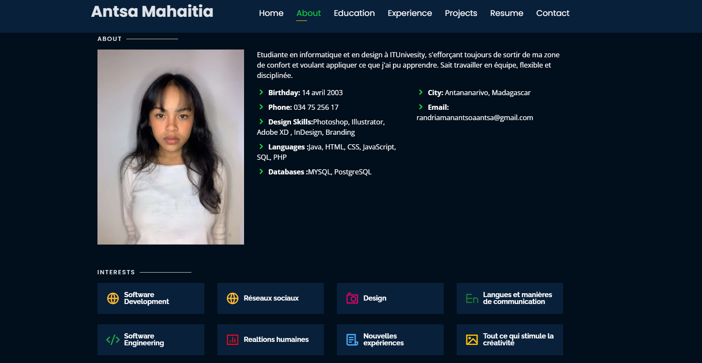

# Personal Portfolio 🔥
> https://antsamahaitia.github.io/

:star: Star me on GitHub — it helps!

### Website Preview
#### Home Page

#### About Page

#### Projects Page

  

:star: Star me on GitHub — it helps!

## Features 📋
⚡️ Fully Responsive\
⚡️ Valid HTML5 & CSS3\
⚡️ Typing animation using `Typed.js`\
⚡️ Easy to modify

## Sections 📚
✔️ About\
✔️ Interests\
✔️ Education\
✔️ Projects \
✔️ Skills \
✔️ Resume\
✔️ Contact Info

## Tools Used 🛠️
* <b>GitHub Pages</b> - To host my static website (HTML, CSS, JS).

#### Step 2

- **Build your code** 🔨🔨🔨

#### Step 3

- 🔃 Create a new pull request.

## License

- **[MIT license](http://opensource.org/licenses/mit-license.php)**
